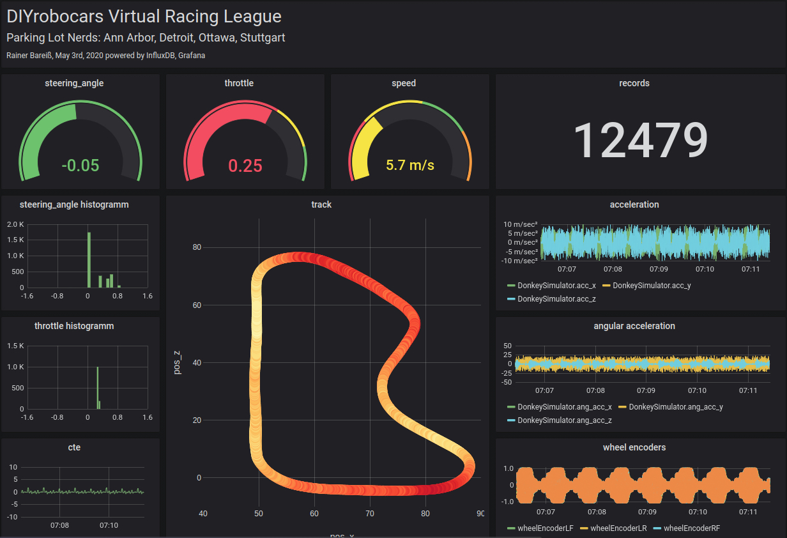
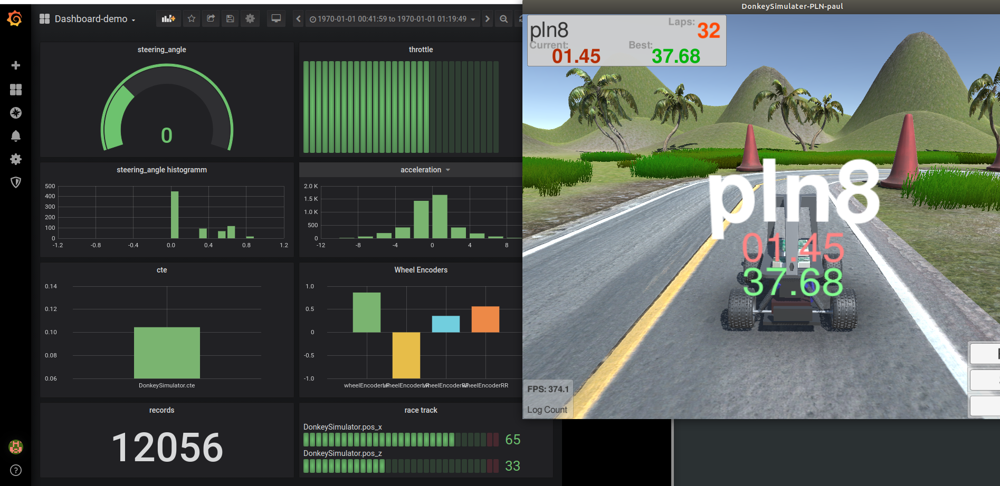
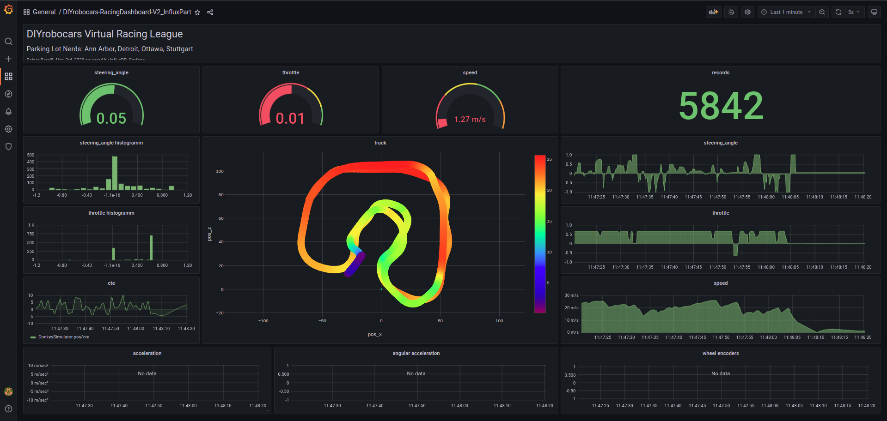
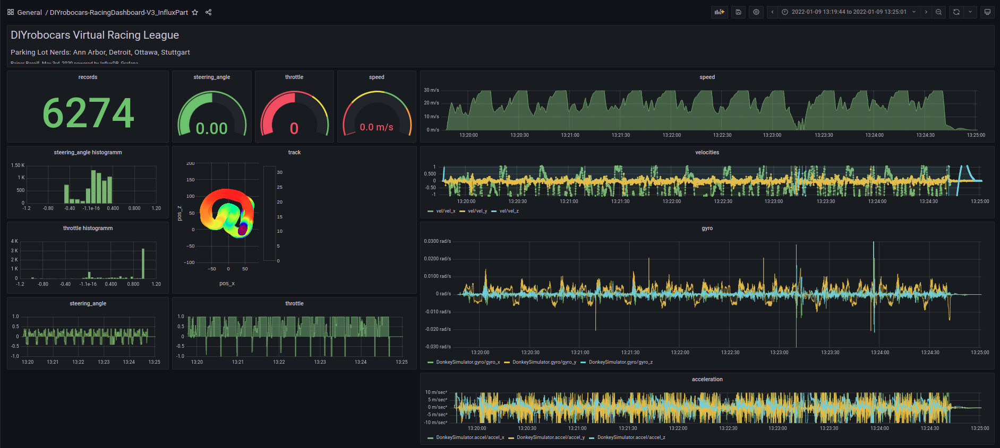
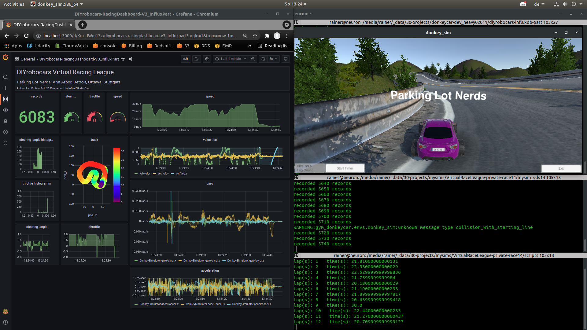
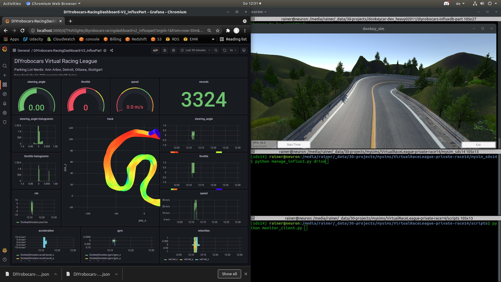

# diyrobocars-influxdb-part
documentation of integration of part influx.py into DIYrobocars.com framework



## 1 Motivation and Background
As I'm again and again stumbling across understanding 
1. parts anatomy and integration
2. my car behaviour during training and race in the simulator

I take the opportunity to document every step to follow on how to integrate a new part - here influx.py - into the donkeycar framework.

The original version was first shown on [discord](https://discord.com/channels/662098530411741184/694603353061195916/705903432120270920) on May 2nd 2020 



and published on the [discord channel](https://discord.com/channels/662098530411741184/671604287419187200/778673564387639367) in this [gist](https://gist.github.com/Heavy02011/0c31b8cd6025f50e7387456b25bffc20) on Nov. 18, 2020.

```
cloud-rocket — 19.11.2020
@Rainer Bareiß ·Parking Lot Nerds - that exactly was my original idea! But I had 2 issues with this approach, before I started implementing it:
1. Isn'tInfluxDB introducing a significant latency?
2. Grafana is fantastic, but it's not exactly mobile application. I'd like to have something on my phone attached to a remote control (better some Android app)..... How do you physically dealing with Grafana on the go?

ref. 1: I ran it on my local machine and did not see that - compared to the other parts - the influxdb introduced too much latency. however I did not measure it.
ref.2: you start an instance of grafana on your preferred server - eg the jetson nano on your car that generates your local wifi network - and connect with the browser on your phone.
ref. implementing: just test the part above. installing influxdb & grafana took me < 30 min on Ubuntu 18.04 on my local machine.
please make sure to set influxdb user & password as environment variables, see the code 

```

## 2 Installation

### 2.1 [Influxdb](https://github.com/influxdata/influxdb-python)
```
$ pip install influxdb
$ sudo apt-get install python-influxdb
```

### 2.2 [Grafana](https://grafana.com/)
```
(follow instructions of grafana.com)
```
### 2.3 [Donkeycar part](https://github.com/Heavy02011/50-donkey/tree/master/rbxparts)
Copy influx.py to the actual (used) donkeycar location
```
cp rbxparts/influx.py /media/rainer/_data/30-projects/donkeycar42_official/donkeycar/donkeycar/parts
```

### 2.4 Reset Grafana Password Locally
```
sudo grafana-cli admin reset-admin-password xyz
```

### 2.5 Install Grafana plugins & Restart Grafana
```
(sds14) rainer@neuron:~$ grafana-cli plugins list-remote|grep plotly
id: ae3e-plotly-panel version: 0.5.0
id: natel-plotly-panel version: 0.0.7

grafana-cli plugins ls

(sds14) rainer@neuron:~$ sudo grafana-cli plugins install natel-plotly-panel
✔ Downloaded natel-plotly-panel v0.0.7 zip successfully

sudo systemctl restart grafana-server
sudo systemctl status grafana-server
```

## 3 Reproducing Previous Installation
```
cd /media/rainer/_data/30-projects/mysims/mysim_robohat2

(sds) rainer@neuron:~/mysim_robohat$ python manage_influx2.py drive --js
```


## 4 Application to race #14 of Virtual Race League
We're having a lot of problems (to due lacking a professional driver ;-) with the stability of our car. This shows a situation with spinning shortly after the finish line and reaching maximum speed.



## 5 HowTo Start


1. modify *your manage.py*, see our [example](mycar/manage_influx3.py) lines 38 & 800
2. start your monitor scripts, e.g. for laptimes etc
3. start your car with
```
python manage_influx3,py drive
```
4. import the [dashboard json](grafana-dashboard/DIYrobocars-RacingDashboard-V2_InfluxPart-1641727550054.json) into grafana
5. open [grafana](127.0.0.1:3000) at your local browser
